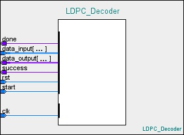
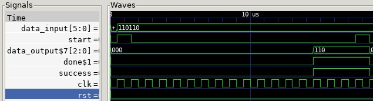
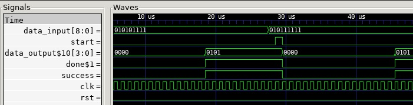

# HDL LDPC Decoder  
[](https://github.com/PaulBryden/hdl_ldpc_decoder/actions)  
A customizable, nMigen-based, 1-bit error correcting, LDPC Decoder IP Core.  
Produced for educational purposes.  

   
## Introduction  
Presented here is a customizable, 1-bit error correcting, nMigen-based LDPC Decoder IP Core.  
The core is located at src/ldpc_decoder.py.  
The IP Core was designed to be extremely flexible, fast and verifiable.  
In order to use this core, the top-level nMigen module which instantiates the core simply needs to provide the length of the input LDPC codeword for a (k,n) LDPC code along with the appropriate parity check matrix 'H' and the size of the output data like so:

```python
    parityCheckMatrix = [[0b111100],
                         [0b001101],
                         [0b100110] ]

    # Instantiate the Decoder Module with parity check matrix, codeword size and data  
    # size as parameters
    m.submodules.LDPC_Decoder = LDPC_Decoder = LDPC_Decoder(parityCheckMatrix,6,3)
```
Verilog or ILang code can then be generated from this top-level module.  
***

When the top-level module is built/generated, an HDL IP Core with 4 input ports and 3 output ports is produced.  
  
These ports are:  
**Input**  
clk - The clock input (width: 1)  
rst - The reset input (width: 1)  
data_input - The codeword to be decoded (width: k, where k = length of codeword)  
start - The signal which initiates the decoding process  (width: 1)

**Output**  
done - A signal which is high only when decoding has finished (width: 1)  
success - A signal which is high only when decoding has succeeded (width: 1)  
data_output - The decoded data  (width: m, where m = decoded data/word size)  

***  
  
In order to demonstrate the power and flexibility of this design, two 'top level' example designs have been produced, both of which use the same ldpc_decoder implementation. These can be found in the root of the project with the names **ldpc_decoder_6_3_toplevel.py** and **ldpc_decoder_9_4_toplevel.py**. These 'top level' nMigen example modules employ (6,3) and (9,4) LDPC codes, respectively and demonstrate just how easy it is to use this LDPC Decoder with any regular (k,n) LDPC Code.  
  
In addition, each 'top level' example design also has an accompanying Verification, Unit Test and Simulation project file which demonstrate the correct operation of the LDPC Decoder implementation.
  
## **Environment Setup**  
  This section will outline the dependencies which are required to be installed in order to:  
  1) Build/Generate the design  
  2) Simulate the design  
  3) Verify the design  

### **Build/Generate Dependencies**  

nMigen:  
<https://nmigen.info/nmigen/latest/install.html>

Yosys, Yosys-SMTBMC and ABC:  
<https://symbiyosys.readthedocs.io/en/latest/quickstart.html#installing>
  
### **Simulation Dependencies**  

Gtkwave:  
```bash
apt install gtkwave
```

### **Verification Dependencies**  

SimbiYosys, Yices 2, Z3 and Boolector:  
<https://symbiyosys.readthedocs.io/en/latest/quickstart.html#installing>

## **Generate/Build Instructions**
After installing nMigen and Yosys, simply run:
```bash
python3 ldpc_decoder_6_3_toplevel.py generate -t v > ldpc_decoder_top.v
```
OR
```bash
python3 ldpc_decoder_9_4_toplevel.py generate -t v > ldpc_decoder_top.v
```
These commands will output the (6,3) or (9,4) LDPC Decoder module in Verilog format which can then be used in an FPGA or ASIC design.

## Simulation
```bash
python3 ldpc_decoder_6_3_sim.py #Run the simulation and generate the output waveform
gtkwave test_6_3.vcd #Open the output waveform
```
OR  
```bash
python3 ldpc_decoder_9_4_sim.py #Run the simulation and generate the output waveform
gtkwave test_9_4.vcd #Open the output waveform
```

## Formal Verification
Formal verification is the process of using Assert, Assume and Cover statements to ensure that the design is fully compliant with any/all design constraints.
```bash
python3 ldpc_decoder_9_4_verification.py generate -t il > toplevel.il
sby -f ldpc_decoder.sby
```
OR  
```bash
python3 ldpc_decoder_6_3_verification.py generate -t il > toplevel.il
sby -f ldpc_decoder.sby
```  

## Unit Testing
Unit testing is the process of providing known inputs to a HDL simulation and validating the outputs are as expected. In this case the unit tests validate that the Decoder can decode 0 bit errors and 1-bit errors for the 6_3 and 9_4 code.
```bash
python3 -m unittest ldpc_decoder_9_4_unit_tests.py
```  
OR  
```bash
python3 -m unittest ldpc_decoder_6_3_unit_tests.py
```

## Results  
Unit Testing:  
[](https://github.com/PaulBryden/hdl_ldpc_decoder/actions)  

**(6,3) LDPC Decoder**  
Simulation:  
  
Formal Verification:
**PASSED**  
  
**(9,4) LDPC Decoder**  
Simulation:  
  
Formal Verification:
**PASSED**  
